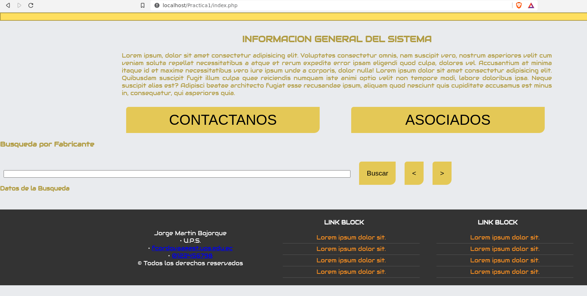
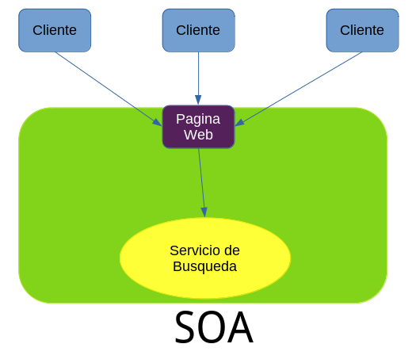
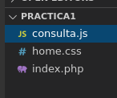
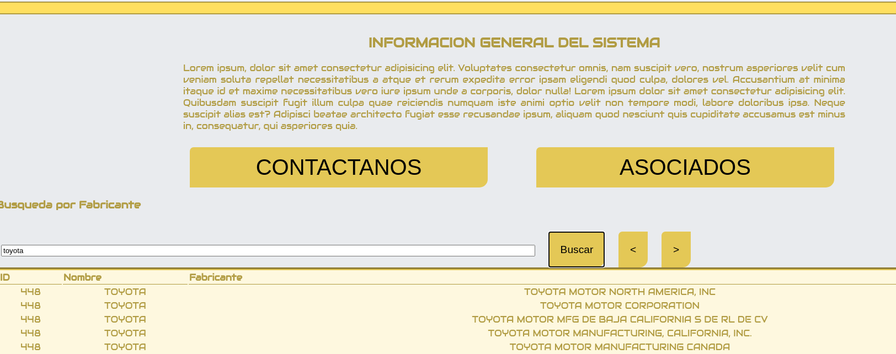
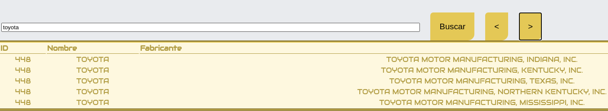

# Practica00-Consumo-de-APIs-en-la-nube

## OBJETIVO ALCANZADO:
- Conocer las arquitecturas y patrones arquitectónicos web para el diseño de aplicaciones web
- Interactuar con servicios web de plataformas en la nube 
### Identificar Graficamente la arquitectura

### Desarrollar una aplicación con HTML + CSS + Javascript + Web Services

### La aplicación Web debe permitir buscar la información a través de un nombre

Además,  se  deberá  visualizar  toda  la  información  disponible  de  la base de datos
### La  aplicación  deberá  aplicar  paginación 

Al momento de ingresar en la pagina se ofrece de manera inmediata el servicio que pretende proveer ademas que se presenta de forma sencilla para una mejor utilizacion del espacio.
## CONCLUSIONES:
El consumo de servivios externos a una pagina web permiten disminuir el tiempo de desarrollo de la misma; esto ademas aporta un grado de fiabilidad. Con esto se pude optar por desarrollar la pagina web o el servicio que ofrece por separado.
